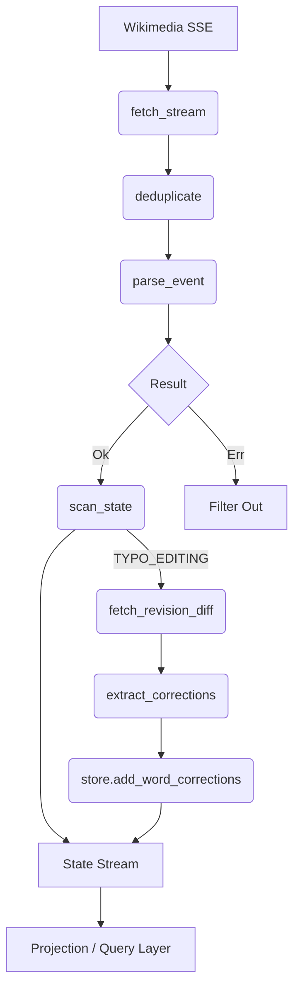

# Wikipedia Real-Time Stream Analyzer (FRP)

A pure Functional Reactive Programming (FRP) implementation for analyzing real-time Wikipedia change streams. This project utilizes the `aiostream` library and custom Monad implementations to achieve a declarative, immutable, and side-effect-isolated architecture.

## 🏗 Core Architecture

### Reactive Flow Diagram


### 1. Functional Reactive Programming (FRP)
The core logic is built using `aiostream` pipelines. Streams are transformed through pipable operators, maintaining a clear separation between data ingestion, transformation, and state accumulation.

- **Source**: `fetch_wikipedia_changes` - A reactive source operator for WikiMedia EventStream.
- **Transformation**: `parse_stream`, `map_maybe`, `filter_edit_type_stream` - Pure functional operators using Monads for safety. `ParsedEvent` carries `old_rev`/`new_rev` revision IDs for downstream diff analysis.
- **State Management**: `aiostream.pipe.accumulate` - Evolves the application state by producing a stream of immutable snapshots (`StatisticsStore`).
- **Word Correction Analysis**: `word_mistake_analyzer.py` — pure module that fetches Wikipedia HTML diffs via `fetch_revision_diff`, extracts `(old_word, new_word)` pairs with positional + Levenshtein alignment, and persists results into the store via `StatisticsStore.add_word_corrections()`.

### 2. Monad-Driven Safety
- **Maybe Monad**: Handles potentially missing or malformed JSON data without explicit `if` checks.
- **Either Monad**: Used in the Query API for type-safe error handling and branching.
- **IO Monad**: Encapsulates side-effects (console logging, file updates) to maintain pure core logic.

### 3. Pure Functional State
The `StatisticsStore` and `UserStatistics` classes are fully immutable. Every update operation returns a **new instance**, ensuring thread safety and predictable state transitions.

## 🚀 Quick Start

### Prerequisites
- Python 3.10+
- `pip install -r requirements.txt`

### Running the Analyzer
```bash
# Start the CLI demo (Pure functional pipeline)
python main.py

# Start the Web Dashboard
python dashboard.py
```

## 📊 Analytics Features
- **Live Event Feed**: Real-time visualization of Wikipedia edits via WebSockets.
- **Cumulative Contribution Series**: Time-series analysis of user activity (X=time, Y=total).
- **Edit Classification**: Automatic detection of typo fixes, content additions, and bot edits.
- **Global Hotspots**: Identification of most active users and highly edited topics.
- **Word Correction Tracking**: Detects the most frequently corrected word pairs across all typo edits by fetching and parsing Wikipedia revision diffs (`get_most_mistaken_words`).

## 🧪 Testing
The project maintains high standards of validation using `pytest`:
```bash
pytest test_functional.py
```

## 📜 Architectural Mandates (GEMINI.md)
This project follows strict engineering standards detailed in `GEMINI.md`, focusing on:
1. Declarative `aiostream` pipelines with mandatory rate limiting.
2. Monad-only error handling and side-effect isolation.
3. Zero state mutation (Pure Functional Updates).
