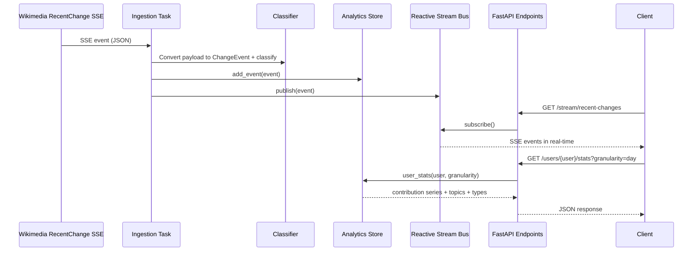

# WikiStream Architecture

## Why FRP (Functional Reactive Programming)

Wikipedia recent change data is an unbounded event stream. FRP matches this naturally by modeling events as immutable values flowing through transformations and sinks:

- **Source**: Wikimedia Event Stream (`/v2/stream/recentchange`).
- **Stream abstraction**: `ReactiveChangeStream` with a reactive `Subject` and async subscribers.
- **Pure processing functions**: contribution classification and typo-word extraction are deterministic and stateless.
- **Stateful projection**: `InMemoryAnalyticsStore` is a materialized read model built by folding incoming events.

This allows near-real-time API results with simple append-only event ingestion.

## Components

1. **Ingestion adapter** (`app/stream.py`): reads Server-Sent Events from Wikimedia and yields payload dictionaries.
2. **Reactive bus** (`ReactiveChangeStream`): fan-out mechanism for live subscribers and API streaming endpoints.
3. **Processing layer** (`app/classifier.py`): maps raw edits to contribution categories.
4. **Read model / analytics store** (`app/store.py`): maintains tracked users and computes query projections.
5. **HTTP API** (`app/api.py`): exposes REST + SSE endpoints.

## Data Flow Sequence Diagram

## API Surface

- `GET /stream/recent-changes`: full real-time stream.
- `GET /stream/users?users=u1,u2`: filtered live stream for user set.
- `POST /users/track`: explicit tracking/creation of users even with no observed edits.
- `GET /users/{user}/stats?granularity=hour|day|month|year`:
  - cumulative contribution points over time,
  - top topics,
  - absolute counts by contribution type.
- `GET /analytics/active-user?period=day|month|year`: most active user.
- `GET /analytics/top-typo-topics`: top 10 topics by typo edits.
- `GET /analytics/common-mistakes`: optional mistaken-word leaderboard from typo comments.

## Quality Validation

- Unit tests cover analytics projections and API behavior.
- Manual verification can be done by running the app and opening SSE endpoints.
